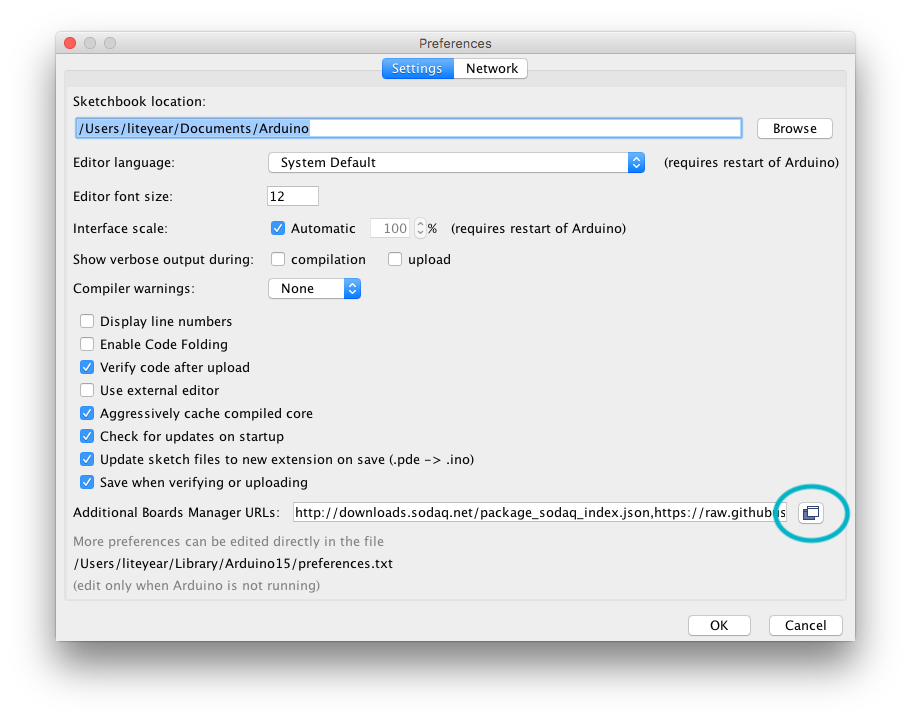
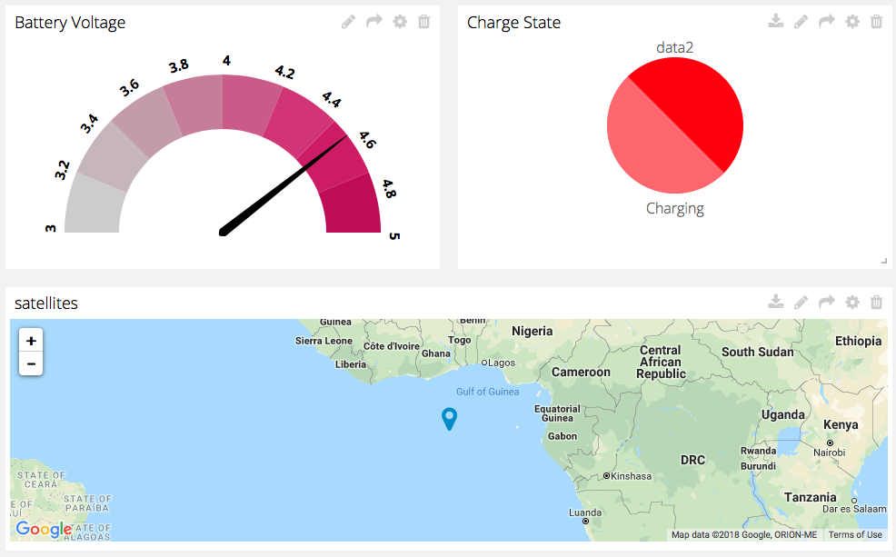

Getting Started with the LoRaWAN (AS923) Kit
====================================

Kit Contents
------------

|# |Component |# |Component |
|---:|:---:|:---|---:|
|1 | Seeeduino LoRaWAN |17 | Grove - Gear Stepper Motor |
|18 | Grove - Piezo Vibration Sensor |
|19 | Red LED w/ resistor |
|20 | Blue LED w/ resistor |
|22 | Grove - LCD RGB Backlight |
|7 | 3.7V LiPo Battery |23 | Grove - Arduino Base Shield |
|8 | Grove - Variable Colour LED |24 | Grove - Light Sensor |
|9 | Grove - Infrared Proximity Sensor /w Cable |25 | Grove - Sound Sensor |
|10 | Grove - LED Bar |26 | Grove - Buzzer |
|11 | M-M Jumper Wire Bundle |27 | Grove - Touch Sensor |
|28 | Grove - LED Socket |
|13 | USB to Micro-USB Cable |29 | Grove - Rotary Angle Sensor |
|14 | Breadboard |30 | Grove - Temperature Sensor |
|15 | Grove - 12AWG Cables (10) |31 | Grove - Button |
|32 | Grove - Stepper Motor Driver |


Installation
------------

1. Plug the Seeeduino LoRaWAN board into the USB port of the computer and verify that the `PWR` LED lights green.

1. In the zip folder you downloaded, open the _DemoApp_ folder in the _LoRaWAN_AS923_ folder.
1. Double-click the _DemoApp.ino_ file to open in Arduino.

1. From the menu bar, select **File > Preferences** or **Arduino > Preferences** menu item.

1. Add the following URL to the _Additional Board Manager URLs_ field and click _OK_.
`https://raw.githubusercontent.com/Seeed-Studio/Seeed_Platform/master/package_seeeduino_boards_index.json`
1. From the menu bar, select **Tools > Board > Boards Manager...**.
1. Enter `Seeeduino` in the search field and then select and install the Seeeduino SAMD Boards item.

1. After installation, click _Close_.
1. Select the menu item **Tools > Board > Seeeduino LoRaWAN**.
1. Select the menu item **Tools > Ports > Seeeduino LoRaWAN**.
1. Click the magnifying glass icon  at the top right labelled _Serial Monitor_.
1. In the text field at the top of the window, type `AT+ID` and press return.
1. If something similar to the following lines appear, then rejoice in having connected to the LoRa modem! If not, try again, check the steps so far, or seek help.

```
+ID: DevAddr, 00:EF:14:E7
+ID: DevEui, 47:86:C5:8B:00:44:00:42
+ID: AppEui, 70:B3:D5:7E:D0:00:BF:CA
```

These three identifiers are key to accessing The Things Network via LoRaWAN.

 * The DevAddr is assigned by the network when you join so it can find your Thing on the network.
 * The DevEui is a globally unique identifier for your Thing - it's so crucial we've stuck it on the bottom of your Thing for reference. Is it correct?
 * The AppEui specifies which "Application" you want your Thing to join. We've already created an application on The Things Network that simply bounces the data from your Thing to Ubidots.

For more information on the identification process, see: [https://www.newieventures.com.au/blogtext/2018/2/26/lorawan-otaa-or-abp](https://www.newieventures.com.au/blogtext/2018/2/26/lorawan-otaa-or-abp)

Connect to LoRaWAN
------------------

1. Compile the DemoApp by clicking the _tick_  button at the top left of the _DemoApp_ window.
Some red and white text output should appear in the black section at the bottom of the window.
	* If _Done compiling_ appears in the green section above the black section, move to the next step.
	* If _Done compiling_ does not appear, double check each of the steps so far or seek some help.


1. Click the "arrow" button  next to the "tick" button to program your changes to the Seeeduino LoRaWAN board. After about 15 seconds _Done uploading_ should appear in the green section. If not, double check the connections or seek help.
1. Take a look at the Serial Monitor. If following appears, then congratulations, you've just connected a new node to the LoRaWAN! If not, double check the steps so far or seek help.

```
+JOIN: Network joined
+JOIN: NetID 000013 DevAddr 26:00:1E:CA
+JOIN: Done
```

Create some Data
----------------
1. Now that our Thing is connected to the Internet, we can start generating some data. Scroll down through the _DemoApp_ code until you get to this line:
	* `return; //DELETE THIS LINE`
1. Go ahead and delete that line. That will enable the `loop` code which by default grabs the battery voltage and charge status, and sends it via LoRaWAN every two minutes.
1. Like before, click the _tick_ button followed by the _arrow_ button to compile and upload the code to your Thing. Watch the serial monitor to ensure the Thing joins the network like before, then sends a LoRaWAN packet. It should look like this:

```
Sending to LoRaWAN...
+MSGHEX: Start
+MSGHEX: Done
```

Verify transmission to Internet
-------------------------------

1. If your Thing is successfully sending data, it's time to check the other end. Open the Ubidots website in a browser and use the username and password provided:
	* `https://app.ubidots.com/accounts/signin/`
	* Username: `canada_bay_workshop`
	* Password: see the bottom of your Thing. Starts with `e`.
1. Click the _Devices_ link near the centre top.
1. Devices are named by their `DevEUI`. If you can find a device matching your `DevEUI` then rejoice in having transmitted your first LoRaWAN message! If not, try refreshing the website, or seek some help.


Working with data
-----------------

1. Click on your device to see the data that was transmitted. The 7 variables include 6 data variables and a GPS data structure. For reference, they are:
	* _data1_ - battery voltage in millivolts
	* _data2_ - battery charging status
	* _data3_ - not assigned
	* _data4_ - not assigned
	* _data5_ - not assigned
	* _data6_ - not assigned
	* _satellites_ - if a GPS is available, can be populated with location information.

1. These raw values are a little hard to work with, so let's create some friendlier variables. Click the _Add Variable_ box at the end of the variables and select _Derived_.
1. Select your device and then select the _data1_ variable.
1. In the edit box that appears, type `/1023*11*3.3` to convert data1 from raw ADC count to volts.
1. Click save and then name the new variable _Battery Voltage_. Note it can take a while for the variable to be saved.
1. Try plugging in your battery (look for the `BAT` connector) to see if the values update.


Create a Dashboard
------------------

1. Time to put this LoRaWAN data to use. Click the _Dashboards_ link near the centre top of the Ubidots website.
1. Remember this is a shared account, so **create your own dashboard**: click the Dashboards icon  near the top left of the window.
1. Click the small orange **"+"** icon  to create a new Dashboard.
1. Give your new Dashboard a name, click the "tick" button, and then click the Dashboard name to open your new Dashboard.
1. Let's create your first widget. Click the big orange "+" icon to add widget, select "Indicator", then "On/Off" and then "Add Variable".
1. Select your device and then select _data2_ (charge status). Change the "Off" message to "Charging" and the "On" message to "Not charging". Pick some suitable colours.
1. Click Finish to see the first widget on your Dashboard. You can move it by dragging it and change its title by clicking on the text and typing in something new.
1. Let's try a Gauge next. Click the big orange "+" icon to add another widget, select "Indicator" and then "Gauge".
1. Select your device and then select the _Battery Voltage_ variable you created earlier.
1. Set the min value to 3 and the max value to 5 and click _Finish_.
1. What about a map? Try adding a map widget. Use the _satellites_ variable and the lat/lng context data will be automatically extracted. Of course, without a GPS on your thing we'll be stuck in [Null Island](https://en.wikipedia.org/wiki/Null_Island).



Get Creative
------------

1. Think about some of the possibilities:
	* What might this data represent?
	* What other sensors (eg. touch, light, sound) could be useful?
	* What if the data triggered an event (eg. email, SMS, Twitter, IFTTT)?
	* How about untethering the board from the computer and running off the battery?
1. Start experimenting. Keep these guidelines in mind:
	* All the data in Ubidots is visible to everyone in the workshop. That means you can add data from other people's Things to your dashboard!
	* That also means you must be careful not to modify dashboards or devices you did not create, or you risk ruining someone else's work.
	* Note that regardless of the data you send, it must fit the existing 6 data value pattern. The first three data values are unsigned integers and the last three are signed integers.
	* You're not restricted to Ubidots. If there's another service you'd like to send the data to, use Ubidots events to push it there.
	* You're not even restricted by TTN Application. The Thing is yours, so feel free to register your own TTN Application.
